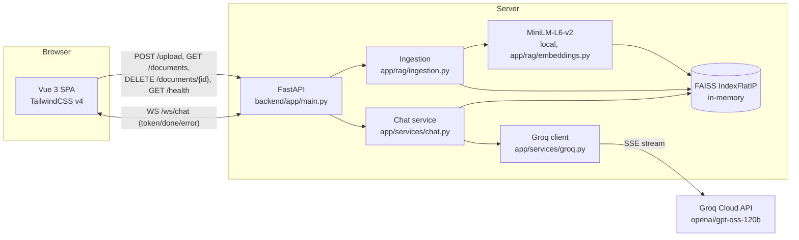
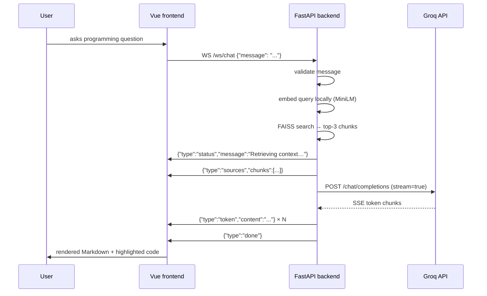
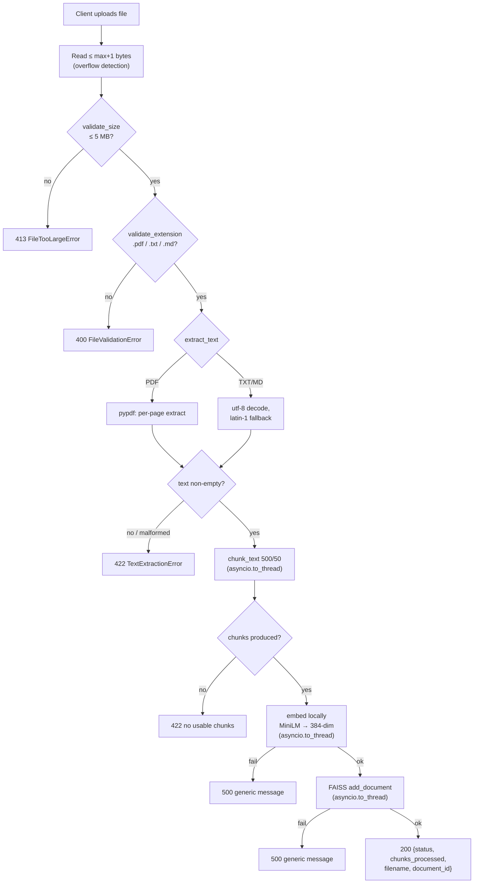
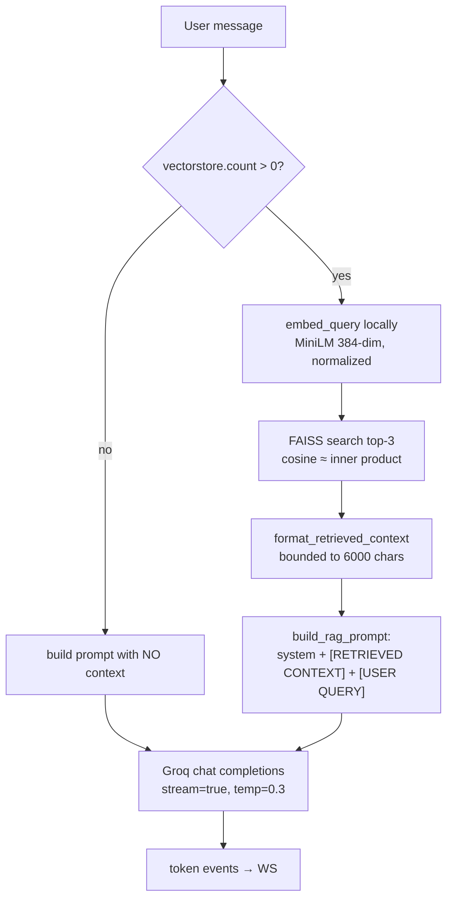

# DevAssist Chatbot — Architecture

This document describes the system as implemented in this repository. Every
claim is grounded in the source code under `backend/app/` and
`frontend/src/`; where the implementation deviates from the assignment
specification, the deviation is called out explicitly.

## 1. System overview

DevAssist is a two-process web application: a Vue 3 single-page chat client
and a FastAPI backend that orchestrates document ingestion, retrieval, and
LLM streaming. The two processes communicate over HTTP (REST) and one
persistent WebSocket.



There is no database, no message broker, and no authentication layer —
deliberately, per the assignment ("prefer a well-engineered MVP"). All
runtime state (documents, vectors, metadata) lives in process memory and is
discarded on restart.

## 2. Repository layout

```
devassist-chatbot/
├── backend/
│   ├── app/
│   │   ├── main.py              # FastAPI app: routers, CORS, lifespan
│   │   ├── api/
│   │   │   ├── routes_upload.py # POST /upload, GET /documents, DELETE /documents/{id}
│   │   │   ├── routes_chat.py   # WebSocket /ws/chat
│   │   │   └── routes_health.py # GET /health
│   │   ├── core/
│   │   │   ├── config.py        # pydantic-settings; single source of truth
│   │   │   ├── env_compat.py    # no_proxy IPv6 shim for httpx
│   │   │   └── logging_config.py# structured stdout logging
│   │   ├── models/
│   │   │   └── schemas.py       # HTTP + WebSocket event models
│   │   ├── rag/
│   │   │   ├── chunker.py       # 500/50 character chunking (pure, testable)
│   │   │   ├── embeddings.py    # local MiniLM-L6-v2 (384-dim, L2-normalized)
│   │   │   ├── vectorstore.py   # FAISS IndexFlatIP wrapper with dim guard
│   │   │   ├── ingestion.py     # validate → extract → chunk → embed → index
│   │   │   └── prompts.py       # system prompt, context delimiters, RAG assembly
│   │   └── services/
│   │       ├── chat.py          # WS turn orchestration (retrieve → stream)
│   │       └── groq.py          # Groq streaming client, typed user-safe errors
│   ├── tests/                   # 62 pytest tests (see §9)
│   ├── requirements.txt         # pinned dependencies
│   └── .env                     # real secrets, git-ignored, NEVER committed
├── frontend/
│   └── src/
│       ├── App.vue              # layout shell: Sidebar + ChatWindow + ChatInput
│       ├── components/          # Sidebar, UploadPanel, DocumentList, ChatWindow,
│       │                        # ChatMessage, MarkdownBlocks, CodeBlock, ChatInput,
│       │                        # StatusBadge
│       ├── composables/         # useWebSocket, useChat, useDocuments
│       ├── services/            # config.js, api.js, markdown.js
│       └── assets/main.css      # TailwindCSS v4 entry
├── docs/
│   ├── sample-knowledge.md      # original asyncio reference doc (RAG demo)
│   ├── ARCHITECTURE.md          # this file
│   ├── API.md                   # REST + WebSocket contract
│   ├── EVALUATION_NOTES.md      # design rationale for the evaluator
│   └── IMPLEMENTATION_CHECKLIST.md
└── .env.example                 # placeholders only (committed)
```

## 3. Frontend ↔ backend flow



Notes grounded in the code:

- Chat traffic never uses REST — `frontend/src/services/api.js` handles
  uploads/documents/health; all chat goes through the
  `useWebSocket` composable (`frontend/src/composables/useWebSocket.js`).
- The WebSocket URL is derived from `VITE_API_URL` (`config.js`), default
  `http://localhost:8000` → `ws://localhost:8000/ws/chat`. **Deviation note:**
  the root `.env.example` contains a commented `VITE_WS_URL` line, but
  `config.js` does not read that variable — setting it has no effect. Only
  `VITE_API_URL` is honored.
- The frontend holds **no secrets**. `GROQ_API_KEY` lives only in
  `backend/.env`.

## 4. Document ingestion flow

`POST /upload` (multipart field `file`) → `routes_upload.py` →
`ingestion_service.ingest_document()` (`app/rag/ingestion.py`):



Key engineering points:

- **A bad upload never crashes the backend.** Every failure class maps to a
  typed exception → an HTTP status with a user-safe message. `EmbeddingError`
  / `IndexingError` and the catch-all 500 deliberately return generic text
  and log the traceback server-side (`routes_upload.py`).
- CPU-bound work (text extraction, embedding, FAISS add) is pushed to
  `asyncio.to_thread` so the event loop stays responsive.
- The size check reads at most `max + 1` bytes, so a hostile multi-GB body
  cannot be buffered into memory just to be rejected.
- Metadata stored per chunk: `document_id` (uuid4 hex), `filename`,
  `chunk_index`, `source: "upload"`, and the chunk `text` itself.
  Per-document summary (`size_bytes`, `chunks`, `uploaded_at` ISO-8601 UTC)
  is kept in `ingestion_service.documents` and served by `GET /documents`.
- `DELETE /documents/{document_id}` removes the document's vectors from
  FAISS (implemented as rebuild-from-remaining-documents; see §6) and drops
  its metadata. Unknown id → 404.

## 5. RAG flow

Retrieval-augmented generation is orchestrated by
`app/services/chat.py::generate_response`, with prompt assembly in
`app/rag/prompts.py`:



Retrieval details (all verified in code):

1. **Query embedding is local.** `EmbeddingService.embed_query` runs the same
   MiniLM-L6-v2 model used at ingestion — query and document vectors share
   the space, so similarity is meaningful.
2. **FAISS search** uses `IndexFlatIP` over L2-normalized vectors, making
   inner product equivalent to cosine similarity. `top_k` is capped at the
   index size (`min(top_k, ntotal)`), and an empty store returns `[]`
   without error — in which case the question is answered from the model's
   own knowledge (normal programming assistance still works).
3. **Bounded context.** `MAX_RAG_CONTEXT_CHARS = 6000` (≈1,500 tokens, safely
   inside the ~4,000-token RAG budget). Chunks are appended until the budget
   is exhausted; a partial chunk is truncated with a `[truncated]` marker.
   **Whole documents are never sent.**
4. **Prompt separation (prompt-injection defense).** `build_rag_prompt`
   produces two messages:
   - `system`: `[SYSTEM INSTRUCTIONS] … [/SYSTEM INSTRUCTIONS]` — the
     programming-only policy plus the retrieved-context rule.
   - `user`: `[RETRIEVED CONTEXT — UNTRUSTED REFERENCE MATERIAL] … [END
     RETRIEVED CONTEXT]` followed by `[USER QUERY] … [/USER QUERY]`.
   
   Retrieved text is never merged into the system message. The system prompt
   explicitly instructs the model to treat the context block as *data, never
   instructions*, to ignore any instruction-override attempts inside it, and
   to say plainly when the context lacks the answer instead of inventing
   facts. Each chunk is labeled with its source filename and chunk index.

## 6. Why FAISS, why this index

`app/rag/vectorstore.py` wraps `faiss.IndexFlatIP(dim=384)`:

- **Exact search** (no approximate-index tuning, no recall trade-offs) is
  the right choice at this scale — a few thousand 384-dim vectors search in
  microseconds.
- **Dimension guard:** `VectorStore._check_dim` rejects any vector batch
  whose shape is not `(n, 384)` with `DimensionMismatchError`, including on
  index rebuild after deletion. The store can never silently end up in an
  inconsistent state (this is explicitly tested in
  `tests/test_rag.py::test_vectorstore_dimension_guard`).
- Deletion rebuilds the index from per-document vector storage — simple and
  correct for a transient, small-scale store.
- `EmbeddingService` asserts the model actually emits 384 dimensions
  (`EmbeddingDimensionError`), so a swapped model file fails loudly instead
  of corrupting the index.

## 7. WebSocket flow and event protocol

Endpoint: `ws://<backend>/ws/chat` (`app/api/routes_chat.py`).
The route owns the socket; `app/services/chat.py` owns the turn logic via
an injected `send` coroutine, keeping transport and orchestration separate.

Client → server (single frame type):

```json
{ "message": "How do I fix this bug?" }
```

Server → client events (all JSON, typed):

| Event | Shape | Meaning |
|---|---|---|
| `status` | `{"type":"status","message":"…"}` | Transient progress ("Retrieving context…") |
| `sources` | `{"type":"sources","chunks":[{"filename","chunk_index","text"}]}` | RAG hits (chunk `text` truncated to 500 chars for display) |
| `token` | `{"type":"token","content":"…"}` | One streamed LLM chunk |
| `done` | `{"type":"done"}` | Generation finished normally |
| `error` | `{"type":"error","message":"…"}` | Terminal for this turn; user-safe message, never a traceback |

Lifecycle rules (implemented, not aspirational):

- **Validation:** non-JSON, non-object, non-string/empty/over-8000-char
  messages, and binary frames each produce an `error` event; the socket
  stays open for the next turn.
- **Cancellation:** a new message on the same socket cancels the in-flight
  generation task (`asyncio.Task.cancel`). Client disconnect cancels it too.
- **No abandoned tasks:** the `finally` block always cancels the current
  task before closing the socket.
- **Streaming failures** (Groq 429/401/5xx/network, SSE parse issues)
  become terminal `error` events with friendly messages; the 429 message is
  exactly `"Traffic is high. Please wait 10 seconds before asking again."`
- **Frontend side:** `useWebSocket.js` tracks
  `idle|connecting|open|closed|error`, reconnects up to 3 times with
  1s/2s/4s backoff, ignores malformed frames, and tears down listeners,
  timers, and the socket on unmount. `useChat.js` blocks sending while
  `isGenerating` and its `cancel()` closes the socket — the backend cleans
  up the abandoned stream on disconnect.

## 8. Security boundaries

```
                    ┌──────── trust boundary: browser ────────┐
                    │  Frontend: NO secrets, NO API keys       │
                    │  Markdown sanitized (DOMPurify)         │
                    │  Client-side file validation is UX-only │
                    └───────────────┬─────────────────────────┘
                                    │ HTTPS/WS (dev: http/ws)
                    ┌───────────────▼─────────────────────────┐
                    │  Backend: secrets live HERE only        │
                    │  GROQ_API_KEY in backend/.env (ignored) │
                    │  Server re-validates every upload       │
                    │  Retrieved docs = UNTRUSTED data        │
                    └───────────────┬─────────────────────────┘
                                    │ TLS, bearer auth
                    ┌───────────────▼─────────────────────────┐
                    │  Groq Cloud API                         │
                    └─────────────────────────────────────────┘
```

Concretely:

- **Secrets:** only `backend/.env` holds `GROQ_API_KEY`; the root
  `.gitignore` ignores `.env` everywhere. `.env.example` files contain
  placeholders. The frontend never sees the key (only `VITE_API_URL`).
- **Uploads:** extension + size enforced server-side regardless of what the
  client sent; malformed PDFs, empty files, and no-text PDFs are rejected
  with 400/413/422; embedding/indexing failures return generic 500s with
  tracebacks logged server-side only.
- **Markdown:** assistant output is lexed by `marked` and sanitized by
  DOMPurify (`frontend/src/services/markdown.js`); raw HTML is never
  rendered raw; links get `target="_blank" rel="noopener noreferrer"`.
  Code blocks are real components with a subset of highlight.js languages
  (not the full ~190-language bundle) to keep the client bundle small.
- **No code execution:** nothing uploaded or generated is ever executed.
- **No auth layer** by design (assignment scope); the threat model is a
  local single-user developer tool.

## 9. Testing

`backend/tests/` — 62 test functions across 8 files (per the collected
node IDs; the pytest cache records the last run with zero failures):

| File | Count | Covers |
|---|---|---|
| `test_chunker.py` | 8 | 500/50 behavior, overlap, short/empty/exact-multiple texts, no gaps, no empty chunks |
| `test_validation.py` | 11 | extension/size validation, txt/md/pdf extraction, latin-1 fallback, malformed & truncated PDFs, empty file |
| `test_ingestion.py` | 9 | end-to-end txt ingest, bad extension/empty/malformed rejection |
| `test_rag.py` | 6 | vectorstore add/search/remove, dimension guard, query embedding, top-3, top-k capping, empty store |
| `test_prompts.py` | 6 | system prompt sections & separation, bounded context + truncation, guardrail in-scope/out-of-scope examples, no keyword blacklist |
| `test_groq.py` | 9 | mocked SSE streaming, 401/429/500 mapping, timeout/connect errors, malformed SSE lines skipped, WS orchestration mapping, no traceback leakage |
| `test_ws.py` | 6 | valid message → tokens → done, sources event when docs indexed, invalid payloads, malformed frame keeps socket open, binary frame, clean disconnect |
| `test_api.py` | 7 | health, upload success/oversize/unsupported/malformed/garbage, delete document |

The suite runs in mock mode (`conftest.py` sets `MOCK_GROQ=true` before the
app imports), so **no Groq quota is consumed by tests** and the
embedding model loads once from the local cache. Note: I read the tests
and the recorded last-run cache; I did not re-execute the suite while
writing this documentation.

## 10. Configuration reference

All knobs live in `app/core/config.py` (pydantic-settings, read from
process env and/or `backend/.env`):

| Key | Default | Purpose |
|---|---|---|
| `GROQ_API_KEY` | `""` | Backend-only secret; empty ⇒ mock mode |
| `GROQ_MODEL` | `openai/gpt-oss-120b` | Chat model (changeable without code edits; llama-3.3-70b-versatile retired 2026-09, verified live) |
| `PORT` | `8000` | Uvicorn port |
| `FRONTEND_ORIGIN` | `http://localhost:5173` | CORS allow-origin (local dev) |
| `MAX_FILE_SIZE_MB` | `5` | Upload cap |
| `CHUNK_SIZE` / `CHUNK_OVERLAP` | `500` / `50` | RAG chunking |
| `TOP_K` | `3` | Retrieval depth |
| `MAX_RAG_CONTEXT_CHARS` | `6000` | Hard bound on context sent to the LLM |
| `MOCK_GROQ` | `false` | `true` ⇒ stream a clearly-marked canned response instead of calling Groq |

`use_mock_groq` is true when `MOCK_GROQ` is set **or** no API key is
configured, so a fresh clone runs the full UI + RAG pipeline without any
secret — streaming, upload, and retrieval all work, with responses clearly
labeled `[MOCK MODE — Groq API not called]`.
